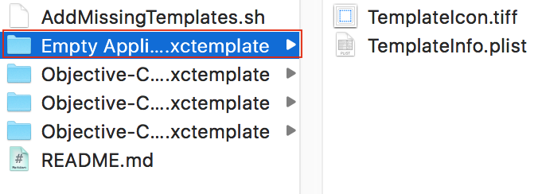
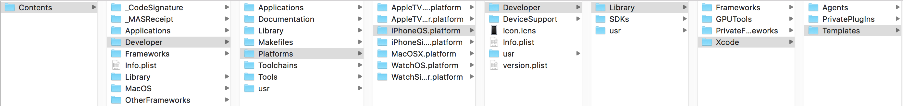
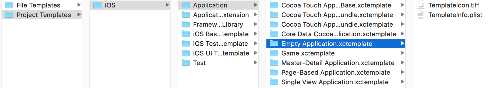

# ZZEmptyApplicationTemplate
**为XCode添加空模板**

----------------------------

把Empty Application.xctemplate拷贝到XCode目录下：

PROJECT_TEMPLATES_PATH="/Applications/Xcode.app/Contents/Developer/Platforms/iPhoneOS.platform/Developer/Library/Xcode/Templates/Project Templates/iOS/Application"  

可以进入到Applications下，右键XCode, 显示包内容，找到content，一层一层找下去，把Empty Application.xctemplate模板拷贝进去:
    

退出再打开XCode:

-----------------------------------------------------------

注：空模板也可以从[这里](http://pan.baidu.com/s/1mgpjQtE)下载